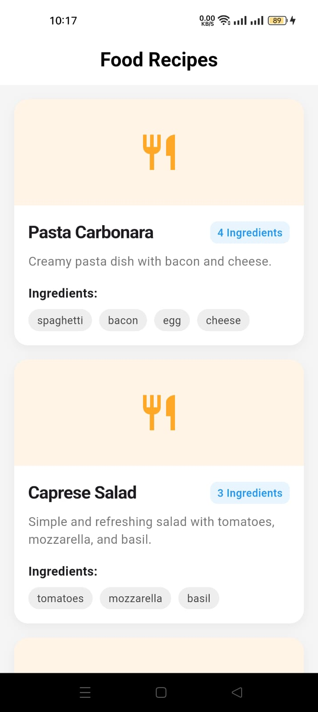

# Food Recipes App

A professional Flutter application demonstrating clean architecture, displaying a list of food recipes with their ingredients.

## Features

- **Recipe List**: View a curated list of delicious food recipes.
- **Ingredient Details**: See a quick summary of ingredients for each dish.
- **Clean Architecture**: Built using a modular and maintainable architecture (Domain, Data, and Presentation layers).
- **Responsive UI**: Clean and modern design that works across different screen sizes.

## Screenshots

<p align="center">
  
</p>

## Tech Stack

- **Framework**: [Flutter](https://flutter.dev/)
- **Language**: [Dart](https://dart.dev/)
- **Architecture**: Clean Architecture (Entities, Repositories, Use Cases, Models)
- **Data Source**: Local JSON assets

## Getting Started

### Prerequisites

- Flutter SDK
- Android Studio / VS Code

### Installation

1. Clone the repository:
   ```bash
   git clone https://github.com/yourusername/livetest.git
   ```
2. Navigate to the project directory:
   ```bash
   cd livetest
   ```
3. Get dependencies:
   ```bash
   flutter pub get
   ```
4. Run the app:
   ```bash
   flutter run
   ```

## Folder Structure

- `lib/domain`: Business logic and entities.
- `lib/data`: Data sources and repository implementations.
- `lib/presentation`: UI widgets and state management.
- `assets`: Contains recipe data in JSON format.
